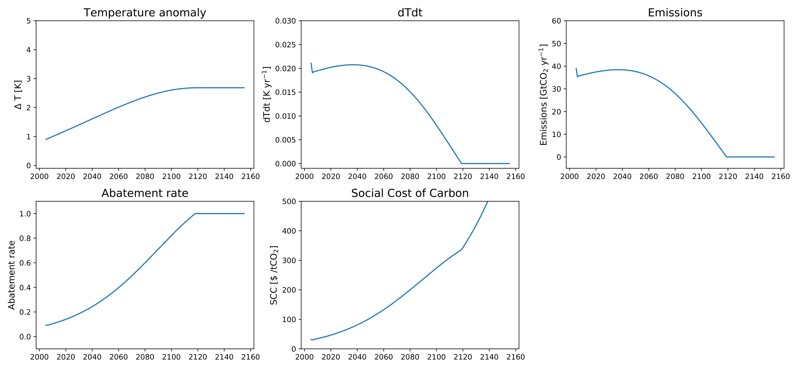
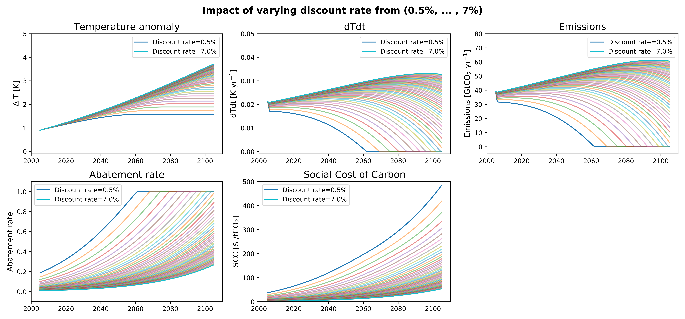

# SimpleClimateEcon
Simple toy model of the coupling between the climate system and an idealized economy.

Useful for pedagogical purposes and for exploring sensitivity of peak warming to various uncertain parameters in ambitious mitigation scenarios.

## Background:
Most simple integrated assessment models (IAMs) exogenously prescribe an emissions pathway, which in theory can then be modified *in situ* by policy parameters through the abatement rate, this limits the possibility of dynamical feedbacks between emissions, temperature and economic growth. 

On the other hand, full complexity IAMs such as DICE often obfuscate the basic ideas at play by treating the abatement rate, , as a free parameter which is optimised in time so as to maximise the utility function. This has a more robust theoretical foundation, however the optimisation procedure used in IAMs is often poorly documented and, as I show here, you can get interesting behaviour without taking this approach.

In `SimpleClimateEcon`, I've tried to make everything as simple as possible: 

Temperatures are set by emissions using the TCRE-relationship, and temperatures then go on to cause economic damages which raises the Social Cost of Carbon (SCC) - you can think of this as the carbon tax. 

The value of the SCC then sets the abatement rate (in theory, through a relationship obtained by parameterizing the output of more complicated IAMs, but for now it's just a linear function of SCC). Finally the abatement rate and the current size of the world economy set emissions for the next timestep through , and the circle of life continues. 

## Example:

```python
import numpy as np
import matplotlib.pyplot as plt
from SimpleClimateEcon import CBA

# Initialise model with default parameters
model = CBA()

# Integrate forward in time
model.forward_integration(nyears=100)

# Plot it
fig, ax = plt.subplots()
model.plot(fig=fig, axs=ax)
```


## Can also do more interesting runs to test sensitivity to parameters such as discount rate

